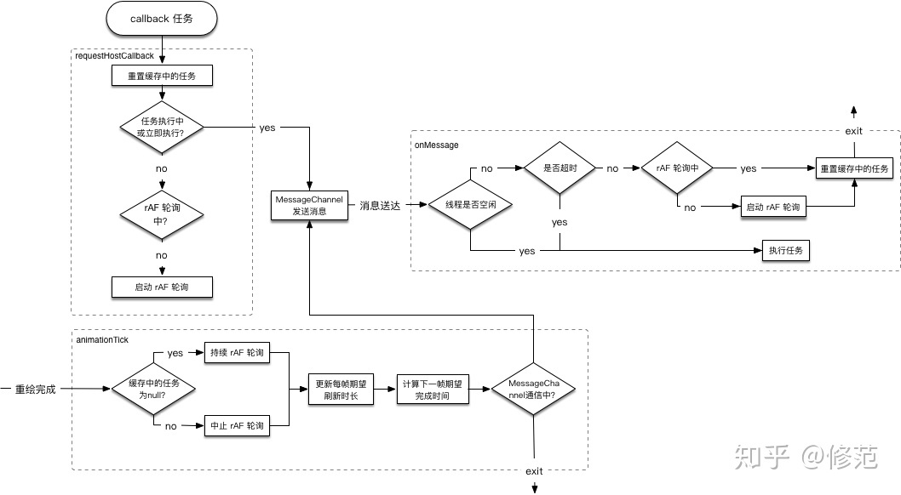
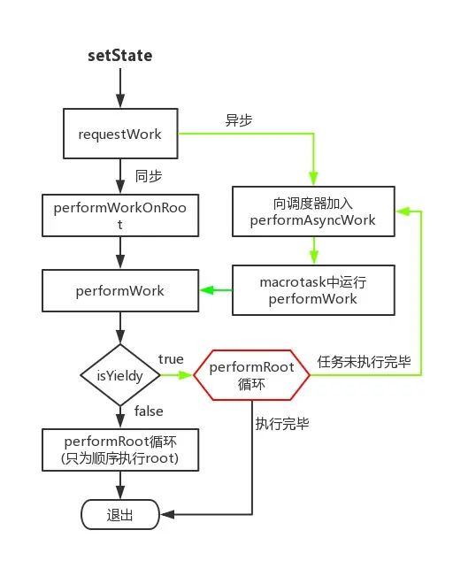
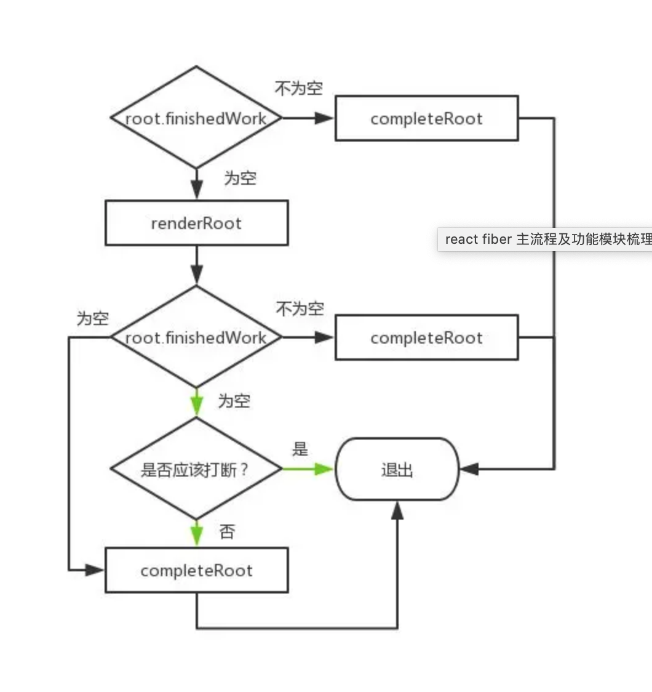

# 🌲2.React 创建 Fiber Root

### React  Fiber 主要流程浅析

#### React 15 调度算法现状

JavaScript 在浏览器的主线程上运行，通常样式计算、布局以及页面绘制会一起运行。如果 JavaScript 运行时间过长，就会阻塞这些其他工作，可能导致掉帧，在首次渲染过程中构建出 Virtual DOM Tree，后续需要更新时（setState()），diff Virtual DOM Tree 得到 DOM change，并把 DOM change 应用（patch）到 DOM 树。自顶向下的递归 mount/update，无法中断（持续占用主线程），这样主线程上的布局、动画等周期性任务以及交互响应就无法立即得到处理，影响体验。所以才有了 Fiber。React Fiber的优化思路

#### React Fiber的优化思路

1. 大任务分解为许多小任务，每个任务都包含过期时间， 优先级，任务可以被更高优先级的任务所打断。

2. 把一次性执行的任务，不能打断的任务，分批次执行，并且加入了超时的机制。优先级的机制。可以随时打断，先执行优先级更高的任务。

3. Fiber 要打断任务，首先是变递归执行的栈结构为链接结构，打断起来性能会更好。

   1. ReactDom.render(APP, dom);

   2. FiberRoot结构
     ```
       function FiberRootNode(containerInfo, tag, hydrate) {
        // 标记不同的组件类型， class / function / protal /  fragment
        this.tag = tag;
        // 当前应用对应的Fiber对象
        this.current = null;
        // root节点
        this.containerInfo = containerInfo;
        // 只有在持久更新中会用到
        this.pendingChildren = null;
        this.pingCache = null;
        this.finishedExpirationTime = NoWork;
        // 在commit阶段只会处理这个值对应的任务
        this.finishedWork = null;
         // 在任务被挂起的时候通过setTimeout设置的返回内容，用来下一次如果有新的任务挂起时清理还没触发的timeout
        this.timeoutHandle = noTimeout;
      }
     ```

   3. Fiber Node结构

      

4. 整体思路是在一个时间段内，react的处理就是在每一帧里，把虚拟Dom转变为FiberNode，处理FiberNode,假如有100个FiberNode需要处理，在这个时间段内处理了50个，打上标记，处理不完的就到下一帧去处理，然后把这50个更新到页面上。同时任务设置了优先级，如果异步任务中有优先级更高的任务，那么就会打断当前任务，先执行优先级更高的任务。这样做就可以在大任务的执行过程中不阻塞dom的渲染，避免掉帧的行为发生。

   1. 问题：假如一个任务的优先级低，被打断了，推迟到下一帧，那下一帧可能也会被推迟，然后一直推迟永远都执行不到呢？

      回答：不会，异步任务如果过期，会获得最高优先级，优先执行， *react以这套时间规则来防止低优先级任务一直被插队。
      
   2. 上面讲到的只是react异步调度里的整体流程，事实上，这个过程没有这么简单。要实现上述的处理过程，就要先知道每一帧的剩余时间，在每一帧的剩余时间里处理任务，我们可以在浏览器提供的requestIdleCallback里处理任务，但requestIdleCallback的功能仍然不能满足react团队的需求，因此，react团队基于requestAnimationFrame实现了一个加强版的requeIdleCallback， 除了具备超时功能，还具备根据优先级打断机制，和 动态调整每一帧时间的机制。

   3. 前置知识
      1. expirationTime 和优先级的关系   每一个Fiber 在创建的时候都会有一个expirationTime，expirationTime标志着这个fiber的优先级，expirationTime越大，优先级越高。                      
         > 这个超时时间实现的非常精妙，我们拿computeAsyncExpiration举例子，在computeExpirationBucket中接收的就是currentTime、5000和250最终的公式就是酱紫的：((((currentTime - 2 + 5000 / 10) / 25) | 0) + 1) * 25

         ``` 
             ceiling(
                   MAGIC_NUMBER_OFFSET - currentTime + expirationInMs / UNIT_SIZE,
                   bucketSizeMs / UNIT_SIZE)

             function ceiling(num: number, precision: number): number {
               return (((num / precision) | 0) + 1) * precision;
             }
         
         
         ```

         > 翻译一下就是：最终结果是以25为单位向上增加的，比如说我们输入10002 - 10026之间，最终得到的结果都是10525，但是到了10027的到的结果就是10550，这就是除以25取整的效果。
         >
         > 其实一句话 100 / 25 | 0 = 4;  4|0 = 0100 | 0000 =>0100
         >
         > 101 / 25 | 0 = 4;  4|0 = 0100 | 0000 =>0100

         React 这么设计抹相当于抹平了25ms内计算过期时间的误差，那他为什么要这么做呢？看到LOW_PRIORITY_BATCH_SIZE这个字样，bacth，是不是就对应batchedUpdates？再细想了一下，这么做也许是为了让非常相近的两次更新得到相同的expirationTime，然后在一次更新中完成，相当于一个自动的batchedUpdates。神奇不神奇？
         
      2. absoluteTimeout 绝对超时时间。当超过这个时间，立即执行
      
      3. frameDeadline  当前帧的截止时间，超过这个时间，到下一帧再去执行，避免掉帧
      
      4. animationTick 调整每一帧的截止时间
      
   4. unstable_scheduleCallback整体流程：



### 

### 2-2.Fiber 核心流程

上述分析只是fiber整个调度任务流程的一部分，下面这张图可以很好的帮我们理解整个调度流程是如何工作的。当调用setState的时候，首先通过requestWork来根据任务的不同来执行不同的逻辑，同步任务拥有最高优先级，直接运行`performWork`，异步则将`performWork`加入到macrotask运行（调度器）；再根据`isYieldy`（是否能打断，同步则不能打断，为false） 来调用不同的`performRoot`循环体。

PerformWorkOnRoot中又可以大体分为两个阶段，一个是renderRoot, 另一个是commintRoot.  renderRoot就是我们常说的reconcile过程，这个过程dom diff，中断的逻辑都在这里执行，但是执行完之后就会给不同的任务打上不同的标记，把改变的东西，也就是副作用，存放在finishdwork里，此阶段相当于执行好了任务，但是并不会渲染到页面。commintRoot 就是我们常说的commit的过程。这个过程把finishdWork中的副作用全部更新到页面上，此阶段就不能被打断了。




PerformWorkOnRoot:




详细流程：


---

### ReactDOM.render的整理流程


志佳老师@2019

