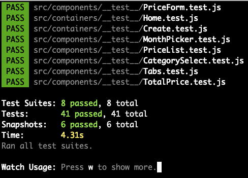
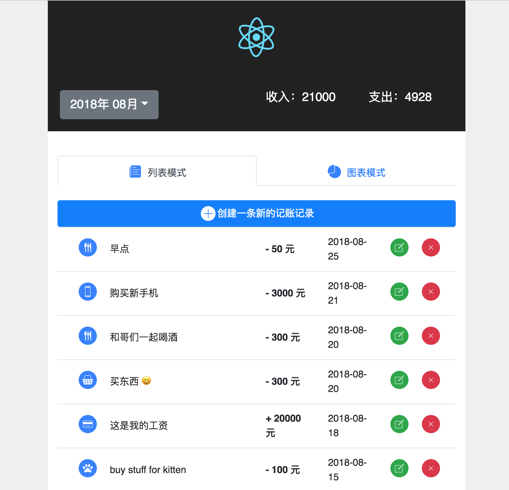
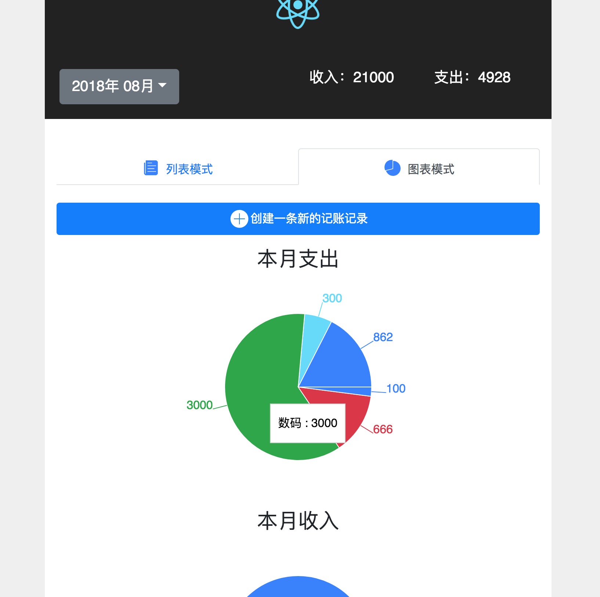
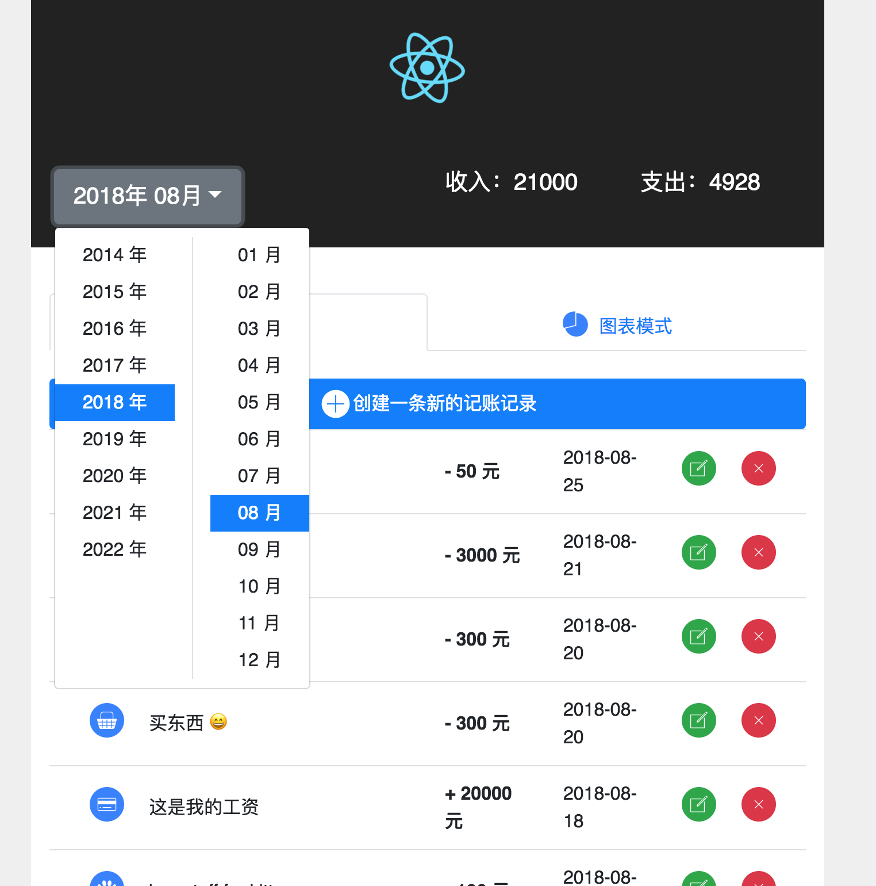

该项目由 [Create React App](https://github.com/facebookincubator/create-react-app) 创建.

#
#qq.891377154
#  React 正确实战的方法 - 项目代码

### 运行

第一次运行首先安装依赖，只需要运行一次

```bash
npm insall
```

然后启动项目

```bash
npm start
```

### 测试

```bash
npm test
```

测试结果截图如下




### 运行环境

本项目在macOS Sierra 10.12.6 或更高版本 以及 Chrome 68或更高版本下运行，其他操作系统和浏览器尚未测试。

### 系统截图

screenshots 文件夹下有系统截图

### 首页



### 首页图表模式



### 修改条目


### 切换月份



